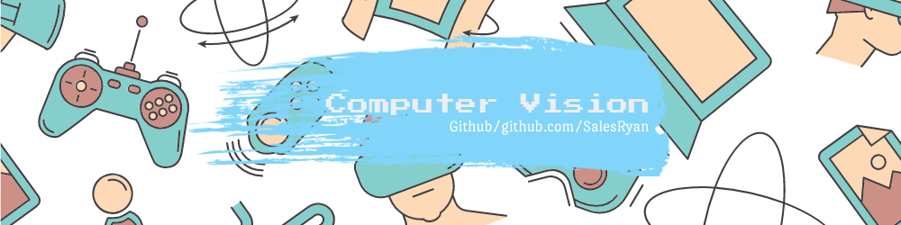

<p align="center">
  
</p>

# computer-vision-game
Repository dedicated to the development of a game using computer vision and image processing.

## Requirements
- [Python3](https://www.python.org/downloads/release/python-382/) 

- *pygame*
```bash
pip install pygame
```

- *numpy*
```bash
pip install numpy
```

- *OpenCV*
```bash
pip install opencv-python
```

## Installation

Clone this repository:

```bash
git clone https://github.com/SalesRyan/computer-vision-game.git
```

## Implementation

### [haarcascades](https://github.com/opencv/opencv/tree/master/data/haarcascades)

Object Detection using Haar feature-based cascade classifiers is an effective object detection method proposed by Paul Viola and Michael Jones in their paper, "Rapid Object Detection using a Boosted Cascade of Simple Features" in 2001. It is a machine learning based approach where a cascade function is trained from a lot of positive and negative images. It is then used to detect objects in other images.

### Structure the classes

#### object_frut
 - *Formulation of the fruit object, for manipulations involving the image, its value type and the color of the punctuation.*

#### player
 - *Formulation of the player object that has attributes of the amount of lives, its score and the amount of fruits that fell.*

#### speed
 - *This class contains the speed and level of the game, ranging from 1 to 4, depending on the player's score.*

#### CalHit
 - *This class contains the coordinates of the last collision the player had, and the time of its consequences.*

### Complementary functions load

#### load_fruts
 - *This function loads the images of the fruits, creates the objects and sets their basic information.*
     
 - *The collision values are 1, 2, 5, 10 and -50, respectively.*

#### setscenario
 - *This function loads the background images that make up the scene.*

#### getEmoji
 - *This function loads the emojis that were used to show the player what the detection status is.*

#### menuImgs
 - *This function loads the menu elements.*
 - *In the start menu the game starts in 2 seconds. To select smile near the start.*
 - *In the About menu the player will be redirected to the github link, and the game will close.*

#### songbackground
 - *This function loads the background music in the main game part.*

#### songexplo
 - *This function carries the sound of the explosion.*

### Update functions

#### score_update
 - *This function aims to produce the score.*

#### calLife
 - *This function aims to produce life.*

#### random_number/random_frut
 - *These functions aim to choose the fruit at random.*

### Collision functions

#### hit_objet
 - *This function calculates the distance of objects.*

#### hit_show
 - *This function produces the collision value text.*

### Object detection function
#### detection
 - *This function aims to detect face, smile and eyes.*

### main
 - *This function is responsible for controlling the gameplay and including all features.*

### menu
- *This function is responsible for managing the menu.*

## About me

Graduation in Information Systems at the Federal University of Piauí, Possibility of experience with developing solutions in the area of Digital Image Processing, Computer Vision and Artificial Intelligence. I currently participate in research projects in the area of Vision and Computational Intelligence.

- [*LinkedIn*](https://www.linkedin.com/in/ryan-sales-2b10141a6/)
- [*Lattes*](http://lattes.cnpq.br/6944781068896428)
- [*Instagram*](https://www.instagram.com/sales.ryann/?hl=pt-br)